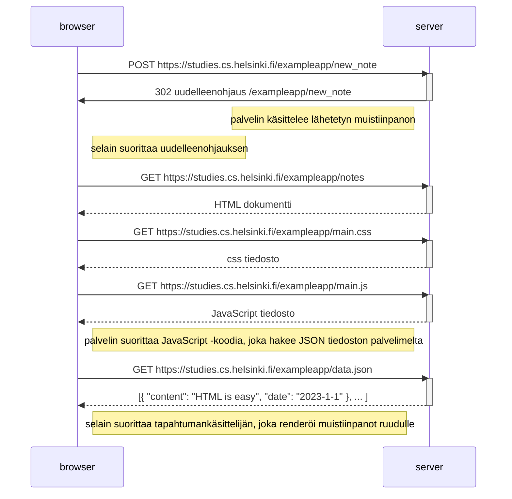

```mermaid
sequenceDiagram
  participant browser
  participant server

  browser->>server: POST https://studies.cs.helsinki.fi/exampleapp/new_note
  activate server
  server->>browser: 302 uudelleenohjaus /exampleapp/new_note
  deactivate server

  note left of server: palvelin käsittelee lähetetyn muistiinpanon

  note right of browser: selain suorittaa uudelleenohjauksen

  browser->>server: GET https://studies.cs.helsinki.fi/exampleapp/notes
  activate server
  server-->>browser: HTML dokumentti
  deactivate server
  
  browser->>server: GET https://studies.cs.helsinki.fi/exampleapp/main.css
  activate server
  server-->>browser: css tiedosto
  deactivate server
  
  browser->>server: GET https://studies.cs.helsinki.fi/exampleapp/main.js
  activate server
  server-->>browser: JavaScript tiedosto
  deactivate server
  
  Note right of browser: palvelin suorittaa JavaScript -koodia, joka hakee JSON tiedoston palvelimelta
  
  browser->>server: GET https://studies.cs.helsinki.fi/exampleapp/data.json
  activate server
  server-->>browser: [{ "content": "HTML is easy", "date": "2023-1-1" }, ... ]
  deactivate server    

  Note right of browser: selain suorittaa tapahtumankäsittelijän, joka renderöi muistiinpanot ruudulle

```
