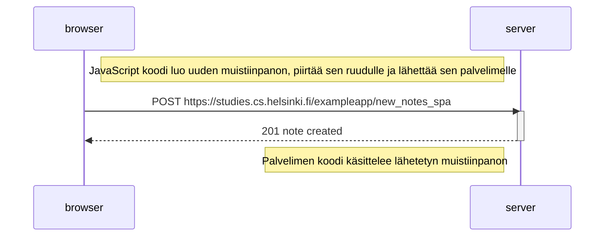

```mermaid
  sequenceDiagram
    participant browser
    participant server

    Note right of browser: JavaScript koodi luo uuden muistiinpanon, piirtää sen ruudulle ja lähettää sen palvelimelle

    browser->>server: POST https://studies.cs.helsinki.fi/exampleapp/new_notes_spa
    activate server
    server-->>browser: 201 note created
    deactivate server

    Note left of server: Palvelimen koodi käsittelee lähetetyn muistiinpanon
```
